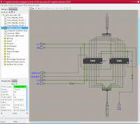

---

[English](/readme.md) | [Portuguese](/README_PTBR.md)

---

Branch [master](https://github.com/logisim-evolution/logisim-evolution/tree/master): 

Branch [develop](https://github.com/logisim-evolution/logisim-evolution/tree/develop): 

---

# Logisim-evolution #

* **Table of contents**
  * [Caracteristicas](#features)
  * [Requisitos](#requirements)
  * **[Downloads](#download)**
    * [Nightly builds (instavel)](#nightly-builds)
  * [Imagens do Logisim-evolution](docs/pics.md)
  * [Mais informação](docs/docs.md)
  * [Bug reports & feature requests](https://github.com/logisim-evolution/logisim-evolution/issues)
  * [Para desenvolvedores](docs/developers.md)
  * [Como contribuir](docs/developers.md#how-to-contribute)
  * [Creditos](docs/credits.md)

---

## Features ##

`Logisim-evolution` é um software educacional para desenhar e simular circuitos lógicos
`Logisim-evolution` é [livre](#license), [open-source](https://github.com/logisim-evolution), e [multi plataforma](#requirements).

Principais caracteristicas:

* fácil de desenhar e projetar circuitos,
* simulação lógica dos circuitos,
* cronograma (para ver a evolução e processo dos sinais no seu circuito),
* ingegração com placas eletrônicas (esquemáticos podem ser simulados em hardware),
* componentes VHDL (comportamento dos componentes podem ser especificados direto em VHDL!),
* TCL/TK console (interfaces between the circuit and the user),
* huge library of components (LEDs, TTLs, switches, SoCs),
* supports [multiple languages](docs/docs.md#translations),
* and more!

---

## Requirements ##

`Logisim-evolution` é um programa em Java; portanto pode rodar em qualquer sistema operacional que suporte o JRE (Java Runtime Enviroment).
Ele requer o [Java 14 (ou mais recente)](https://www.oracle.com/java/technologies/javase-downloads.html).

---

## Download ###

`Logisim-evolution` está disponivel para
[download já compilado](https://github.com/logisim-evolution/logisim-evolution/releases)
e pronto para uso nas plataformas: Windows, macOS, e Linux
ou [direto da fonte](https://github.com/logisim-evolution), para que você possa [compilar](docs/developers.md).

The following [platform specific packages](https://github.com/logisim-evolution/logisim-evolution/releases)
include the Java runtime and do not require it to be installed separately:

* `logisim-evolution_<version>-1_amd64.deb`: Debian package (also suitable for Ubuntu and derivatives),
* `logisim-evolution-<version>-1.x86_64.rpm`: Package for Fedora/Redhat/CentOS/SuSE Linux distributions,
* `logisim-evolution-<version>.msi`: Installer package for Microsoft Windows,
* `logisim-evolution-<version>.dmg`: macOS package. Note that `Logisim-evolution` may also be installed
  using [MacPorts](https://www.macports.org/) (by typing `sudo port install logisim-evolution`)
  or via [Homebrew](https://brew.sh/) (by typing `brew install --cask logisim-evolution`).

The Java JAR [`logisim-evolution-<version>-all.jar`](https://github.com/logisim-evolution/logisim-evolution/releases)
is also available and can be run on any system with a supported Java runtime installed.

**Note for macOS users**:
The Logisim-evolution.app is not code-signed.
The first time you launch it, you should do so by ctrl- or right-clicking the app and selecting `Open`,
 which will give you a panel that allows you to open it.
Depending on your security settings, you may also get a panel asking if you wish to allow it to accept network connections.
You can click `Deny`.

### Nightly builds ###

We also offer builds based on the current state of the
[develop](https://github.com/logisim-evolution/logisim-evolution/tree/develop) branch.
If the develop branch has been changed,
a new `Nightly build` is created at midnight [UTC](https://en.wikipedia.org/wiki/Coordinated_Universal_Time).

Note that these builds may be unstable since the develop branch is a work in progress.

To get nightly downloads, please
[click here](https://github.com/logisim-evolution/logisim-evolution/actions/workflows/nightly.yml)
and browse to the last successful run of `Nightly build`, which should be on top. Note that due to Github internals,
all files are provided as ZIP archives. You must unzip the downloaded file to get the package for installation.

Please share your experience in [Discussions](https://github.com/logisim-evolution/logisim-evolution/discussions)
or [open a ticket](https://github.com/logisim-evolution/logisim-evolution/issues)
if you found a bug or have suggestions for improvement.

---

## License ##

* `Logisim-evolution` is copyrighted ©2001-2021 by Logisim-evolution [developers](docs/credits.md).
* This is free software licensed under [GNU General Public License v3](https://www.gnu.org/licenses/gpl-3.0.en.html).
