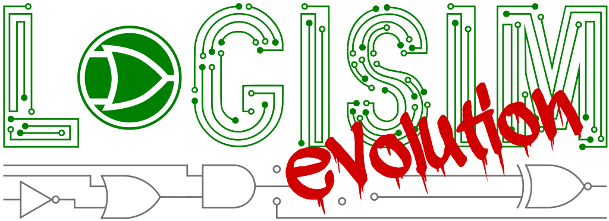

---

# Additional information #

* [« Go back](../README.md)
* **Additional information**
  * [History of Logisim](#project-history)
  * [External documentation](#external-reads)
  * [Legacy support](#legacy-support)
  * [Translations](#translations)
  * [Alternative software](#alternatives)

---

## Project history ##

Logisim is an educational tool for designing and simulating digital logic circuits. It was originally created
by [Dr. Carl Burch](http://www.cburch.com/logisim/) and actively developed until 2011.
After this date, the author focused on other
projects and the development has been [officially stopped](http://www.cburch.com/logisim/retire-note.html).

In the meantime, people from a group of Swiss higher education institutions
([Haute École Spécialisée Bernoise](http://www.bfh.ch),
[Haute École du paysage, d'ingénierie et d'architecture de Genève](http://hepia.hesge.ch),
and [Haute École d'Ingénierie et de Gestion du Canton de Vaud](http://www.heig-vd.ch)) started developing a version of
Logisim that fit their courses by integrating several new tools, e.g., a chronogram, the possibility to test the
schematics directly on an electronic board, TCL/TK consoles, …

We have decided to release this new Logisim version under the name `Logisim-evolution` to highlight the large number of
changes that were made.

**We actively seek the [contributions](developers.md#how-to-contribute) of the community!**

## External reads ##

* [Here](http://reds-data.heig-vd.ch/logisim-evolution/IntroToLogisimEnglish.pdf) you can find a tutorial (French
  version [here](http://reds-data.heig-vd.ch/logisim-evolution/tutoLogisim.pdf)) that explains some basic usage of Logisim.
  The electronic card referenced in the tutorial is a small card we use in our laboratories -- you won't be able to buy it
  in a store -- but the descriptions should be good enough to be used for another generic board.
* Another good reference is [this book](https://github.com/grself/CIS221_Text/raw/master/dl.pdf), the
  accompanying [lab manual](https://github.com/grself/CIS221_Lab_Manual/raw/master/dl_lab.pdf),
  and [YouTube channel](http://bit.ly/2KLMcoc), where basic electronics is explained with the help of Logisim.
* Some circuit examples, ranging from simple combinational and sequential logic to advanced datapaths, that are useful
  for teaching and learning computer organization topics can be found
  [here](https://github.com/mkayaalp/computer-organization-logisim).

## Legacy support ##

We cannot guarantee backward compatibility of `Logisim-evolution` with files created by the legacy Logisim.
We have incorporated a parser that alters the name of the components to satisfy VHDL requirements for variable names,
but components have evolved in shape since the original Logisim.
You might need to rework your circuits a bit when opening them with `Logisim-evolution`, but the changes
will be stored in the new format.

# Translations #

`Logisim-evolution` is built with multi-language support, which means we have done our best to ensure all messages and
texts you see on the screeen can be translated. Many of them were automatically translated using [DeepL](https://www.deepl.com/).
If you should find bizarre translations, please do not hesitate to [correct them](developers.md)
in the corresponding property files and to make a pull request!

---

# Alternatives #

* A complete rewriting of Logisim, called [Digital](https://github.com/hneemann/Digital), has been developed by
  Prof. Helmut Neemann of the Baden-Württemberg Cooperative State University Mosbach.

Other forks of Logisim:

* [Logisim-Evolution (Holy Cross Edition)](https://github.com/kevinawalsh/logisim-evolution) - a fork from
  Logisim-evolution 2.13.14 with several great enhancements made by Kevin Walsh.
  Currently, there is an ongoing effort to merge these features back into Logisim-evolution.
* [Logisim by Joseph Lawrance et al.](https://github.com/lawrancej/logisim) - they have started from Burch's original code and
  integrated it in several open-source development frameworks, cleaning up the code.
  We have taken a few code cleanups and the redo functionality from their code.
* [logisim-iitd](https://code.google.com/p/logisim-iitd) - IIT Delhi version of Logisim, it integrates the
  floating-point components within the arithmetic unit.
* [Logisim for the CS3410 course, Cornell University](http://www.cs.cornell.edu/courses/cs3410/2015sp/) - they have a very
  interesting test vector feature, that was later integrated into Logisim-evolution.
